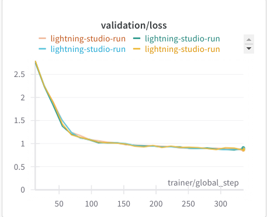

# GPT-2 applications:
*This repo is motivated by Sebastian Raschka's book "Build a Large Language Model from Scratch".*

> Thanks to Lightning Studios for providing access to a GPU and a great dev environment.


## Instruction Finetuning with LoRA:

### Deployment and testing:

* Build the image:

	```bash
	docker build -t flask-gpt -f api_server/Dockerfile .
	```
* Run the container:
	```bash
	docker run -p 5000:5000 --name flask-cont-1 flask-gpt
	```

	and start giving instructions:


* The bot "knows" the capital of Bulgaria:

	```bash
	curl -X POST http://0.0.0.0:5000/predict -H "Content-Type: application/json" -d '{"instruction": "What is the capital of Bulgaria?"}'
	```

	I get the answer:

	```bash
	{"body":"{\"answer\": \"### Response:\\nThe capital of Bulgaria is Sofia.<|endoftext|>\"}","headers":{"Content-Type":"application/json"},"statusCode":200}
	```

	which is correct! Without any entry relating to Bulgaria in the finetuning instructions.

* Let's see if it can deal with inputs:

	```bash
	curl -X POST http://0.0.0.0:5000/predict -H "Content-Type: application/json" -d '{"instruction": "Classify an input string as either a noun or a verb.", "input": "Dance"}'
	```

	I got

	```bash
	{"body":"{\"answer\": \"### Response:\\nDance is a verb.<|endoftext|>\"}","headers":{"Content-Type":"application/json"},"statusCode":200}
	```

	which is correct.

* Interestingly the bot seems to "think" it's a student from Berkeley.

	```bash
	curl -X POST http://0.0.0.0:5000/predict -H "Content-Type: application/json" -d '{"instruction": "who are you"}'
	```

	```bash
	{"body":"{\"answer\": \"?\\n\\n### Response:\\nI am a student at the University of California, Berkeley.<|endoftext|>\"}","headers":{"Content-Type":"application/json"},"statusCode":200}
	```

* The decoding above is greedy, so I tried a stochastic decoding with `temperature=1`.

	```bash
	curl -X POST http://0.0.0.0:5000/predict -H "Content-Type: application/json" -d '{"instruction": "who are you", "temperature": 1}'
	```

	and I got

	```bash
	{"body":"{\"answer\": \"?\\n\\n### Response:\\nI am a member of the Royal Society of London.<|endoftext|>\"}","headers":{"Content-Type":"application/json"},"statusCode":200}
	```

	so the stochastic decoding functionality works!

### My improvements on the book's contents:
* I did everything in Lightning - making it much more robust and customisable when it comes to running experiments.
* Also added attention padding mask for the input tokens. setting attention of any proper token to a padding token to `0`.
* I trained my model in `bfloat16` for more speed and less memory consumption.
* I implemented my own `LoRA` finetuning utilities, which help me do parameter-efficient fine-tuning rather than changing the weights of the entire model.
* I used Weights & Biases for experiment tracking.


### Running the fine-tuning script:
* I fine-tuned a `gpt2-medium` checkpoint from hugging face's repo of openai.

* Frist, cd in the root of the repo.
* Second, run `export PYTHONPATH=.`
* Third, run `wandb login` to login to the wandb with your api key.
* Fourth, run `export WANDB_START_METHOD="thread"` otherwise some weird threading exception occurs. For more info see this <a href="https://github.com/wandb/wandb/issues/3223#issuecomment-1032820724">issue</a>.
* Fifth, run the training command to train on `GPU`:

	```bash
	python training/run_finetuning.py fit --config finetune_config.yaml --trainer.accelerator=gpu --trainer.devices=1 --trainer.max_epochs=48 --trainer.check_val_every_n_epoch=2 --trainer.log_every_n_steps=5 --data.num_workers=4 --my_model_checkpoint.every_n_epochs=4 --model.lr=3e-4 --model.do_lora=true --model.lora_rank=8 --model.from_pretrained_model=gpt2-medium --data.batch_size=128 --trainer.precision=bf16-true
	```

* I checked `lora_rank` in `[8, 16, 32, 64]` and there wasn't much difference in loss or generated responses, so I sticked to `lora_rank=8` for my final model. the final validation loss with this is around `0.8672` and the final training loss is around `0.7617`.

* The fine-tuning was done on a single `L4` GPU and each run took around 5 minutes when in `bfloat16` format (and around 9 minutes if in full precision).

### Data:
The same dataset used as in chapter 7 from the book. I think it's a subset of the Alpaca dataset.

Link to the data in json format is <a href="https://raw.githubusercontent.com/rasbt/LLMs-from-scratch/main/ch07/01_main-chapter-code/instruction-data.json">here</a>

The size of the data were:

```json
{
  "train_len": 935,
  "val_len": 55,
  "test_len": 110
}
```

as per the <a href="./data/raw/metadata.json">metadata.json</a> file.

### Results:

* The logs from generating responses to a subset of the validation set at the end of training:

	

	All generations ended with the `<|endoftext|>` token, so they the model "knew" when to stop and did not require truncation.

* Training loss for `lora_rank in [8, 16, 32, 64]`.

	

	Roughly the same for all settings of `lora_rank`.

* Validation loss for `lora_rank in [8, 16, 32, 64]`.

	

* GPU utilisation:

	

### Interesting errors caught during developing:

* Interesting error for torch determinstic run of `nn.functional.cross_entropy`. Resolved by setting `--trainer.deterministic=false`.

	```
	return torch._C._nn.cross_entropy_loss(input, target, weight, _Reduction.get_enum(reduction), ignore_index, label_smoothing)
			^^^^^^^^^^^^^^^^^^^^^^^^^^^^^^^^^^^^^^^^^^^^^^^^^^^^^^^^^^^^^^^^^^^^^^^^^^^^^^^^^^^^^^^^^^^^^^^^^^^^^^^^^^^^^^^^^^^^^
	RuntimeError: nll_loss2d_forward_out_cuda_template does not have a deterministic implementation, but you set 'torch.use_deterministic_algorithms(True)'. You can turn off determinism just for this operation, or you can use the 'warn_only=True' option, if that's acceptable for your application. You can also file an issue at https://github.com/pytorch/pytorch/issues to help us prioritize adding deterministic support for this operation.
	```

### Quick dev run on `CPU`:

```bash
python training/run_finetuning.py fit --config finetune_config.yaml --trainer.accelerator=auto --trainer.devices=1 --trainer.max_epochs=2 --trainer.check_val_every_n_epoch=1 --trainer.log_every_n_steps=25 --data.num_workers=1 --my_model_checkpoint.every_n_epochs=2 --model.lr=5e-5 --model.do_lora=true --model.from_pretrained_model=gpt2-medium --trainer.limit_train_batches=2 --trainer.limit_val_batches=2
```

## Lessons learned:

### MHA
* Lots of memory caching going on in parallel attention implementation as compared to for loop over heads implementation. Makes sense since each head computation is a lot less than doing everything at once. PyTorch and TensorFlow seem to be caching intermediate results.

### Pre-norm vs Post-norm <a href="https://arxiv.org/pdf/2002.04745">paper here</a>
* The dataset for testing this was <a href="https://en.wikisource.org/wiki/The_Verdict">"The Verdict"</a> as per chapter 5 of the "Build a Large Language Model from Scratch" book.
* Pre-norm looks to work a lot better than post-norm. When pre-training `gpt2-small` from scratch for 10 epochs, I got `0.7651` loss with `pre-norm` and `6.0799` with `post-norm`.
	* 10 epochs of training with `pre-norm` led to Average batch train loss in epoch of `0.7651`.
		* Given the prompt *"Every effort moves you"*, the generation via sampling with `temperature=1` is:

			> Every effort moves you?"\n\n"Yes--quite insensible to the irony. She wanted him vindicated--and by me!"\n\nHe laughed again, and threw back his head to look up at the sketch of the donkey. "There were days when I'
	* 10 epochs of training with `post-norm` led to Average batch train loss in epoch of `6.0799`
		* Given the prompt *"Every effort moves you"*, the generation via sampling with `temperature=1` is:

			> Every effort moves you,,,,,,,,,,,,,,,,,,,,,,,,,,,,,,,,,,,,,,,,,,,,,,,,,,

### Decoder Layer clones vs fresh inits:
* Fresh inits, as expected, worked better. Idk why the PyTorch implementation
	of `TransformerDecoder` opts in for clones of `TransformerDecoderLayer`
	as per <a href="https://github.com/pytorch/pytorch/blob/main/torch/nn/modules/transformer.py#L452">this</a>.

### Registering the causal mask as a buffer:
If you don't register non-parameter members of the class, they are not moved to the correct device when doing `model = model.to(device)`. Before I registered the mask as a buffer, my program was complaining I had some tensors on `cuda` and others on `cpu`.

```python
mask = utils.get_subsequent_mask(context_length)
self.register_buffer("mask", mask, persistent=True)
```

### The way to use positional embeddings:

Since I use `nn.Embedding` layers, I used to use their forward pass like:

```python
return x + self.embed(torch.arange(x.size(-2)))
```

However, when training on GPU, `torch.arange` returns a tensor on the CPU, and then I also got tensors on different devices (cuda and cpu).

I fixed this by doing:

```python
return x + self.embed.weight[:x.size(-2), :]
```

which just adds the first `x.size(-2)` embedding vectors.